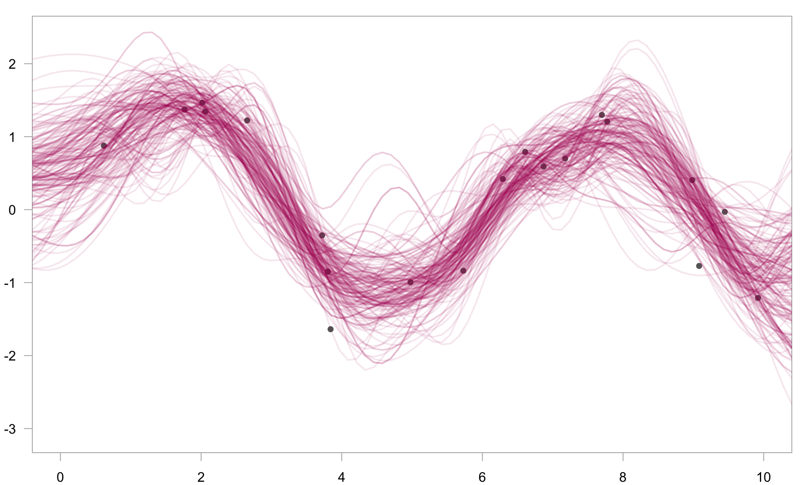

gretaGP
-------

#### Gaussian processes in greta

gretaGP extends greta to let you define Gaussian processes as part of your model.

##### example

``` r
# simulate data
x <- runif(20, 0, 10)
y <- sin(x) + rnorm(20, 0, 0.5)
x_plot <- seq(-1, 11, length.out = 100)
```

``` r
library (gretaGP)

# hyperparameters
rbf_var = lognormal(0, 1)
rbf_len = lognormal(0, 1)
obs_sd = lognormal(0, 1)

# kernel
k1 <- rbf(rbf_len, rbf_var)  # wiggly kernel
k2 <- bias(1) + linear(1)  # linear kernel
k <- k1 + k2  # combined kernel

# GP, likelihood & predictions
f = gp(x, k, tol = 1e-4)
distribution(y) = normal(f, obs_sd)
f_plot <- project(f, x_plot)
```

``` r
# fit
m <- model(f_plot)
draws <- mcmc(m, n_samples = 200)
```

``` r
# plot
plot(y ~ x, pch = 16, col = grey(0.4), xlim = c(0, 10), ylim = range(draws[[1]]))
for (i in 1:200) {
  lines(draws[[1]][i, ] ~ x_plot,
        lwd = 2,
        col = rgb(0.7, 0.1, 0.4, 0.1))  
}
```



##### installation

This package currently depends on the GPflow python package and the gpflowr R package, both of which must be installed before gretaGP will run.

You can install GPflow with pip by typing something like this at a command prompt:

    git clone https://github.com/GPflow/GPflow.git
    cd GPflow && python setup.py install && cd ..

You can install gpflowr, the latest version of greta, and this package with the following R commands:

``` r
library (devtools)
install_github("goldingn/gpflowr")
install_github("greta-dev/greta")
install_github("greta-dev/gretaGP")
```

[](https://travis-ci.org/greta-dev/gretaGP) [](https://codecov.io/github/greta-dev/gretaGP?branch=master)
