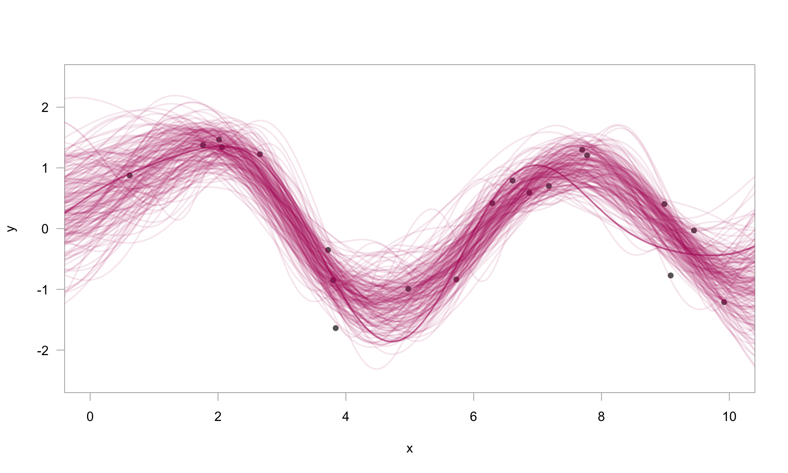

<!-- README.md is generated from README.Rmd. Please edit that file -->

# greta.gp: Gaussian Process in `greta`

<!-- badges: start -->

[](https://github.com/greta-dev/greta.gp/actions/workflows/R-CMD-check.yaml)
[](https://app.codecov.io/gh/greta-dev/greta.gp?branch=master)
<!-- badges: end -->

`greta.gp` extends greta to let you define Gaussian processes as part of
your model. It provides a syntax to create and combine GP kernels, and
use them to define either full rank or sparse Gaussian processes.

## Installation

You can install the current release version of `greta.gp` from CRAN:

``` r
install.packages("greta.gp")
```

Or install the development version of `greta.dynamics` from
[r-universe](https://greta-dev.r-universe.dev/ui#builds):

``` r
install.packages("greta.gp", repos = "https://greta-dev.r-universe.dev")
```

You can also install the development version of `greta.gp` via GitHub:

``` r
remotes::install_github("greta-dev/greta.gp")
```

## Example usage

``` r
# simulate data
x <- runif(20, 0, 10)
y <- sin(x) + rnorm(20, 0, 0.5)
x_plot <- seq(-1, 11, length.out = 200)
```

``` r
library(greta)
library(greta.gp)

# hyperparameters
rbf_var <- lognormal(0, 1)
rbf_len <- lognormal(0, 1)
obs_sd <- lognormal(0, 1)

# kernel & GP
kernel <- rbf(rbf_len, rbf_var) + bias(1)
f <- gp(x, kernel)

# likelihood
distribution(y) <- normal(f, obs_sd)

# prediction
f_plot <- project(f, x_plot)
```

``` r
# fit the model by Hamiltonian Monte Carlo
m <- model(f_plot)
draws <- mcmc(m, n_samples = 250)
```

``` r
# plot 200 posterior samples
# plot 200 posterior samples
plot(
  y ~ x,
  pch = 16,
  col = grey(0.4),
  xlim = c(0, 10),
  ylim = c(-2.5, 2.5),
  las = 1,
  fg = grey(0.7),
)
for (i in 1:200) {
  lines(draws[[1]][i, ] ~ x_plot,
        lwd = 2,
        col = rgb(0.7, 0.1, 0.4, 0.1))  
}
```



## Code of Conduct

Please note that the greta.gp project is released with a [Contributor
Code of
Conduct](https://greta-dev.github.io/greta.gp/CODE_OF_CONDUCT.html). By
contributing to this project, you agree to abide by its terms.
